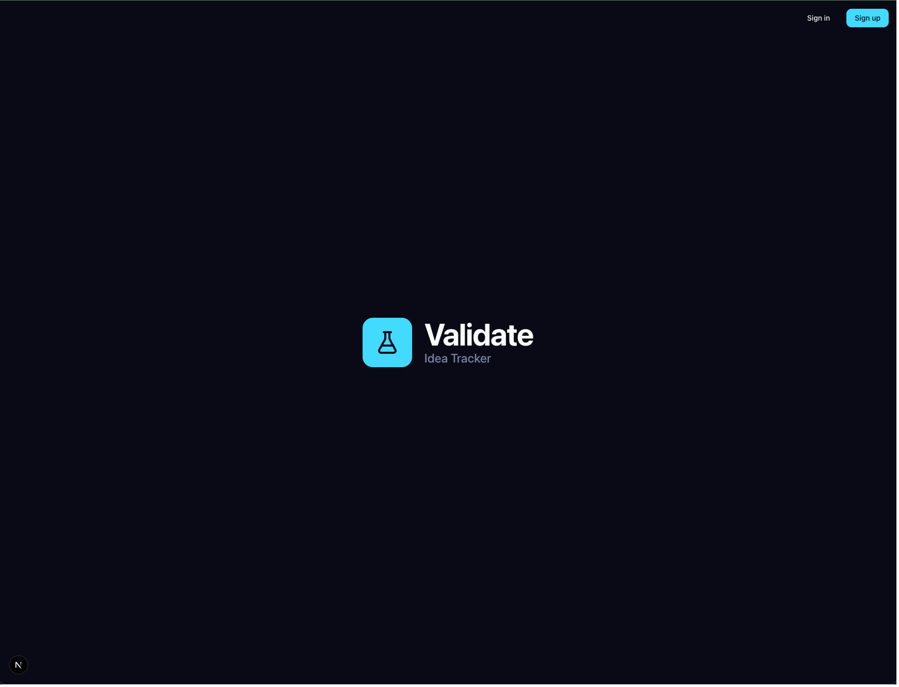

# IDEA TO EXECUTION TRACKER

**Live Preview:** [Your idea to execution tracker](https://idea-to-execution-tracker.vercel.app/)

**IDEA TO EXECUTION TRACKER** is an idea-to-execution tracker designed to help entrepreneurs and creators rigorously test their business ideas. Instead of jumping straight into building, Validate guides you through a structured process of identifying assumptions, running experiments, and tracking results to ensure you're solving a real problem for a real market.

## 🚀 Features

- **Idea Management**: Capture and organize your ideas. Define the core concept, target market, and the problem you're solving.
- **Assumption Mapping**: Break down ideas into testable assumptions. Rate your confidence level to prioritize what needs testing first.
- **Experiment Tracking**: Design experiments to validate or invalidate your assumptions. Formulate hypotheses, plan steps, and track status.
- **Result Analysis**: Record the outcomes of your experiments. Document key insights, what worked, what didn't, and decide on the next actions based on evidence.

## 🛠️ Tech Stack

This project is built with a modern, type-safe stack:

- **Framework**: [Next.js 15+](https://nextjs.org) (App Router)
- **Language**: [TypeScript](https://www.typescriptlang.org)
- **Database**: [PostgreSQL](https://postgresql.org) (via [Neon](https://neon.tech) Serverless)
- **ORM**: [Drizzle ORM](https://orm.drizzle.team) for type-safe database interaction
- **Authentication**: [Better Auth](https://www.better-auth.com) for secure user management
- **Styling**: [Tailwind CSS v4](https://tailwindcss.com) for utility-first styling
- **Forms**: [React Hook Form](https://react-hook-form.com) + [Zod](https://zod.dev) for validation
- **UI**: Custom components built with Radix UI primitives and Lucide icons

## 🏁 Getting Started

### Prerequisites

- Node.js (v18+)
- pnpm (v9+)
- A PostgreSQL database (e.g., Neon)

### Installation

1.  **Clone the repository:**

    ```bash
    git clone https://github.com/yourusername/validate.git
    cd validate
    ```

2.  **Install dependencies:**

    ```bash
    pnpm install
    ```

3.  **Set up environment variables:**

    Create a `.env` file in the root directory and add your database connection string and authentication secrets.

    ```bash
    DATABASE_URL="postgresql://..."
    BETTER_AUTH_SECRET="your-secret-here"
    BETTER_AUTH_URL="http://localhost:3000"
    ```

4.  **Push the database schema:**

    ```bash
    pnpm drizzle-kit push
    ```

5.  **Run the development server:**

    ```bash
    pnpm dev
    ```

    Open [http://localhost:3000](http://localhost:3000) with your browser to see the result.

## 🤝 Contributing

Contributions are welcome! Please feel free to submit a Pull Request.

## 📄 License

This project is open source and available under the [MIT License](LICENSE).
